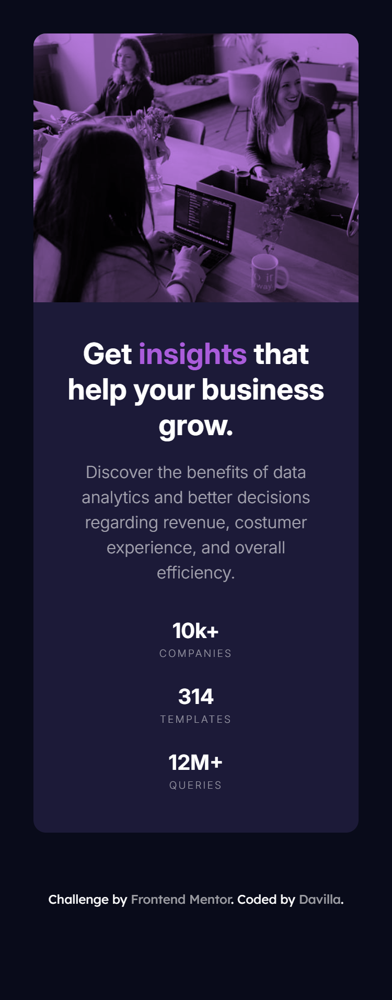
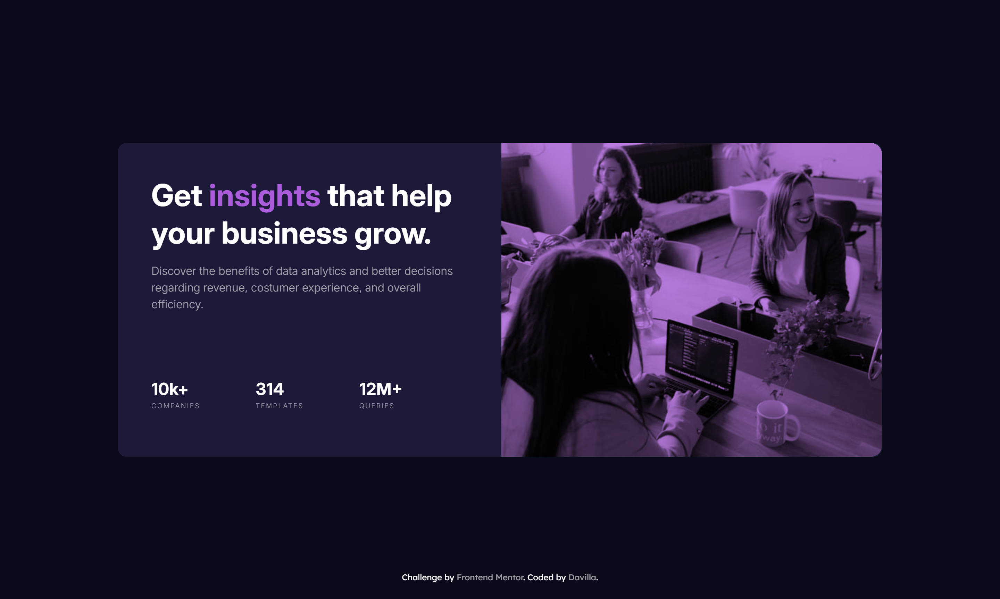

# Frontend Mentor - Solução do Stats Preview Card Component

Esta é uma solução para o [desafio Stats Preview Card Component do Frontend Mentor](https://www.frontendmentor.io/challenges/stats-preview-card-component-8JqbgoU62). Os desafios do Frontend Mentor ajudam você a aprimorar suas habilidades de codificação construindo projetos realistas.

## Sumário

- [Visão geral](#visão-geral)
  - [Captura de tela](#captura-de-tela)
  - [Links](#links)
- [Meu processo](#meu-processo)
  - [Ferramentas utilizadas](#ferramentas-utilizadas)
  - [O que aprendi](#o-que-aprendi)
  - [Desenvolvimento futuro](#desenvolvimento-futuro)
  - [Recursos úteis](#recursos-úteis)
- [Autor](#autor)

## Visão geral

## O desafio

**Os usuários devem ser capazes de:**

- Visualizar o layout ideal dependendo do tamanho da tela do dispositivo
- Ver a imagem com overlay roxo aplicado corretamente
- Navegar pelo conteúdo de forma responsiva (mobile e desktop)
- Experimentar acessibilidade básica (skip link, reduced motion)

### Captura de tela

| Mobile                             | Tablet                             | Desktop                              |
| ---------------------------------- | ---------------------------------- | ------------------------------------ |
|  |  |  |

### Links

- URL da solução: [https://github.com/Davilla07/Stats-Preview-Card-Component](https://github.com/Davilla07/Stats-Preview-Card-Component/)
- URL do site ao vivo: [https://davilla07.github.io/Stats-Preview-Card-Component](https://davilla07.github.io/Stats-Preview-Card-Component/)

## Meu processo

### Ferramentas utilizadas

- HTML5 semântico com srcset e sizes para imagens responsivas
- Variáveis CSS (Design System)
- Metodologia BEM para arquitetura CSS
- Função clamp() para tipografia fluida e responsiva
- Flexbox e CSS Grid para layout
- Fluxo de trabalho mobile-first
- Acessibilidade: skip link, prefers-reduced-motion, alt descritivo

### O que aprendi

Este projeto consolidou conhecimentos do desafio anterior e introduziu novas técnicas avançadas:

## 🖼️ Imagens verdadeiramente responsivas com srcset e sizes:


**Aprendizado:**
Aprendi que srcset não é só "bom ter" — é essencial para performance. O navegador escolhe a imagem certa baseado no dispositivo e viewport, economizando banda e melhorando o LCP (Largest Contentful Paint).

## 📏 Tipografia fluida com clamp():

```css
.card__content--title {
  font-size: clamp(1.75rem, 3vw + 1rem, 2.75rem);
}
```

**Aprendizado:**
clamp(mínimo, ideal, máximo) eliminou a necessidade de múltiplos media queries para ajustar fontes. O texto escala suavemente entre breakpoints, criando uma experiência mais orgânica.

## 🎨 Overlay de cor com ::before e mix-blend-mode:

```css
.card__img-container {
  position: relative;
  background-color: var(--text-accent);
}

.card__img-container::before {
  content: "";
  position: absolute;
  inset: 0;
  background-color: var(--text-accent);
  opacity: 0.8;
  mix-blend-mode: multiply;
  z-index: 1;
}
```

**Aprendizado:**
Em vez de aplicar 4 propriedades diferentes na imagem (filter, opacity, transform, mix-blend-mode), usei um pseudo-elemento com blend mode. Resultado: código mais limpo, performático e fácil de ajustar.

## 🧱 Consolidação de CSS redundante:

```css
/* ANTES: 3 classes idênticas */
.card__statistics--companies {
  display: flex;
  flex-direction: column;
}
.card__statistics--templates {
  display: flex;
  flex-direction: column;
}
.card__statistics--queries {
  display: flex;
  flex-direction: column;
}

/* DEPOIS: Uma classe só */
.card__statistics li {
  display: flex;
  flex-direction: column;
  gap: var(--sp-xs);
}
```

**Aprendizado:**
Identificar e eliminar duplicação de código é sinal de maturidade. Menos CSS = menor bundle, mais fácil manutenção.

## ♿ Acessibilidade como padrão, não exceção:

```css
<a
  href="#main-content"
  class="skip-link"
  > Skip
  to
  main
  content</a
  > @media
  (prefers-reduced-motion: reduce) {
  * {
    animation-duration: 0.01ms !important;
    transition-duration: 0.01ms !important;
  }
}
```

**Aprendizado:**
Reapliquei as práticas do desafio anterior (skip link, reduced motion, alt descritivo) criando um padrão consistente. Acessibilidade deve ser reutilizável, não "reinventada" a cada projeto.

## Desenvolvimento Futuro:

- Pré-processadores CSS (SASS) - Variáveis aninhadas, mixins, funções personalizadas
- Metodologia BEM completa - Estrutura bloco\_\_elemento--modificador consistente
- Bootstrap - Componentes responsivos e grid system profissional
- Tailwind CSS - Utility-first para desenvolvimento ágil
- Transições e animações CSS - Keyframes, timing functions, performance
- Acessibilidade avançada - WCAG 2.1, testes com leitores de tela
- CSS Container Queries - Responsividade baseada no container, não viewport

## Autor

- Frontend Mentor - @Davilla07
- GitHub - @Davilla07
